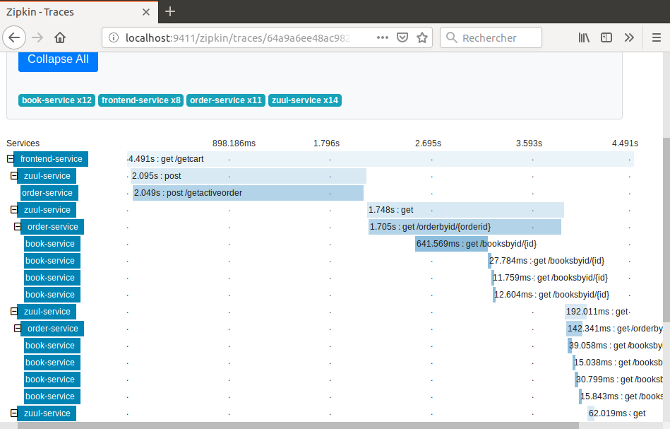
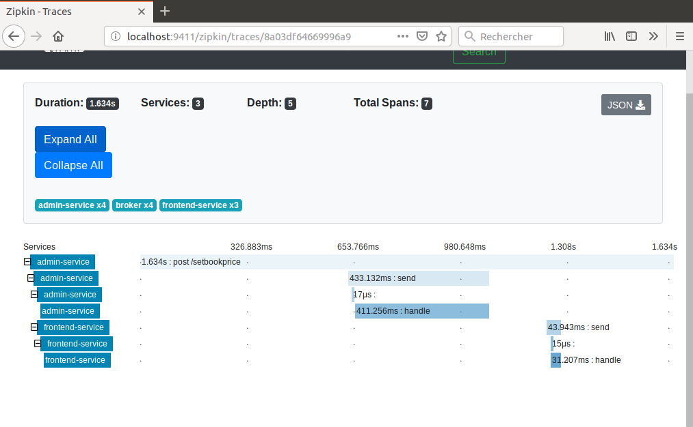
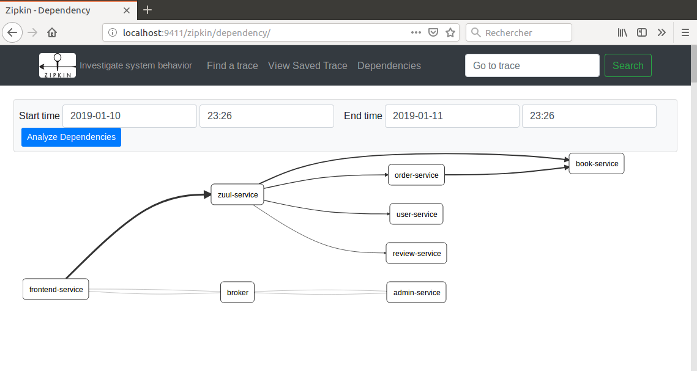

# gutenberg-sleuth
I present here a microservice-oriented application that uses some basic Docker features including docker-compose. It consists of a collection of separate servers all running in Docker containers. All servers send traces to a Zipkin server also running in a container.

Here are the prerequisites for running the complete application:

A recent Docker version installed (I used 17.12.0-ce)
A recent Apache Maven version installed (I used 3.3.9)
A Docker Redis image.
A Docker RabbitMQ image with management UI.
An HTTP tool like Postman or equivalent. 

In addition I used Spring Tool Suite for developing this demo but it is not required for running the application.

Here is the list of all 13 containers:

Server            | Image                     | Port         | Function             | Database connection
---------------   | ------------------------- | ------------ | -------------------- | -------------------
rabbitmq-server   | rabbitmq:3-management     | 15672, 5672  | Messaging broker     | 
config-server     | gutenberg/config-server   | 8888         | Configuration server | None
eurekaserver      | gutenberg/eureka-service  | 8761         | Discovery server     | None
books-mongodb     | mongo                     | 27017        | Schemaless database  |
book-service      | gutenberg/book-server     | 8081         | Book requests        | booksonline
review-service    | gutenberg/review-server   | 8082         | Review requests      | booksonline
order-service     | gutenberg/order-server    | 8083         | Order requests       | booksonline
user-service      | gutenberg/user-server     | 8084         | User requests        | booksonline
zuul-service      | gutenberg/zuul-server     | 5555         | Gateway              | None
admin-service     | gutenberg/admin-server    | 9090         | admin server         | booksonline
redis-service     | redis                     | 6379         | Cache                | None
frontend-service  | gutenberg/frontend-server | 8080         | frontend             | None
zipkin-server     | gutenberg/zipkinsvr       | 9411         | trace collector      | in-memory

Some volumes are used for persistence. They are listed below:

Volume external name  | Server          | Volume type | Source     | Target
--------------------- | --------------- | ----------- | ---------- | -----------------
gutenberg-rabbitmq-db | rabbitmq-server | volume      | rabbitmqdb | /var/lib/rabbitmq
gutenberg-books-db    | books-mongodb   | bind        | booksdb    | /data/db
 
A gateway is used to hide some Spring servers. Here is the list:

Server           | Port | Gateway URI
---------------- | ---- | -------------------------
book-service     | 8081 | zuul-service:5555/books
review-service   | 8082 | zuul-service:5555/reviews
order-service    | 8083 | zuul-service:5555/orders
user-service     | 8084 | zuul-service:5555/users

Here are the steps to run the application:

# 1. Images creation

In each of the 10 project subdirectories:

config-server
eureka-service
book-server
review-server
order-server
user-server
zuul-server
admin-server
frontend-server
zipkinsvr

run the command: `[sudo] mvn clean package docker:build`

This will create the 10 Spring images. The remaining non Spring images will be pulled from a Docker repository.

Note: Zipkin server dependencies are no more managed by Spring Cloud. Only Zipkin client dependencies are. 

# 2. Volumes creation

In subdirectory docker/rabbitmq run the script:

```
./rabbitVolume.sh
```

This will start a RabbitMQ container. Then connect to RabbitMQ management on port 15672 (user guest, password guest), create a topic exchange named bookChangeTopic and a user spring with password password1234 with access permissions to this exchange. Then log out from management.
Then kill the container using the command:

```
./rabbitKill.sh
```

This kills the container but leaves the volume gutenberg-rabbitmq-db populated. 


In subdirectory docker/booksonline run the scripts:

```
./booksBuild.sh
./booksVolume.sh
```

This will start a MongoDB container.
Then kill the container using the command:

```
./booksKill.sh
```

This kills the container but leaves the volume gutenberg-books-db populated. 

# 3. Running the application

To start the application go to docker subdirectory and run the command:

```
sudo docker-compose up
```

All running Spring containers can be seen on Eureka port 8761.

The frontend itself is accessed on URL localhost:8080/gutenberg. A username and password are required. Here are the prepopulated users:

Username | Password
-------- | --------- 
Carol    | s1a2t3o4r 
Albert   | a5r6e7p8o
Werner   | t4e3n2e1t
Alice    | o8p7e6r5a
Richard  | r1o2t3a4s
Sator    | sator1234 
Arepo    | arepo1234
Tenet    | tenet1234
Opera    | opera1234
Rotas    | rotas1234


To stop the application run the command in docker subdirectory:

```
sudo docker-compose down
```

# 4. Using admin-service
To access admin-service the best way is to use Postman or any equivalent application. The URI is localhost:9090/admin.

Here are two snapshots of Postman interaction:


# 5. Accessing MongoDB container
To access the MongoDB container run the command:

```
sudo docker exec -it docker\_books-mongodb\_1 /bin/bash
```
Then in container shell run the command:

```
mongo -u spring -p password1234 --authenticationDatabase booksonline
```

and then for example to display orders collection:

```
use booksonline
db.orders.find().pretty()
```

# 6. Using Redis cache and messaging

Some frontend-server requests use Redis cache instead of a request to book-server. When a book price is changed by admin-server then a message is produced by admin-server with the book ID in the payload. This message is consumed by frontend-server that invalidate the Redis cache key for this book. 

Note that in this implementation traces are sent to Zipkin over HTTP rather than over the broker. I chose this approach to keep things simple and avoid any addditional configuration.

# 7. Tracing requests and messages

To see traces connect to Zipkin server by hitting the URL localhost:9411. 

All requests traces can be analyzed. An example is shown on this snapshot:



Message traces can be analyzed. An example is shown on this snapshot:



Dependencies can be displayed. An example can be seen on this snapshot:




